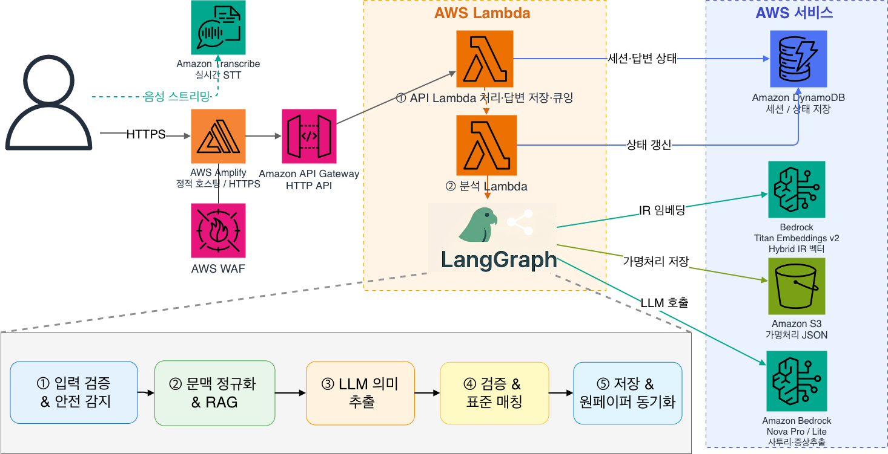

<div align="center">

<h1>
  
  문진톡톡 · MunjinTalkTalk
</h1>

[한국어](README.md) · **English**

Easier for seniors to speak, faster for clinicians to review.

An AI questionnaire-assistant MVP that structures spoken answers from elderly patients, matches them to standard symptoms, and validates them — turning them into a *clinician one-pager* before the visit and a *patient guide* after the visit.


<br/>

<a href="https://main.dv5herezqtt1t.amplifyapp.com">
  
</a>
<a href="https://sw.kangwon.ac.kr/Home/H10000/H10300/boardView?board_key=4285">
  
</a>

<sub>🏆 Excellence Award (최우수상), Kangwon National University SW-Centered University Program «2026 X+AI·SW Convergence Project» competition · <a href="https://sw.kangwon.ac.kr/Home/H10000/H10300/boardView?board_key=4285">School announcement</a> · <a href="docs/문진톡톡_발표자료.pdf">📊 Slides (PDF)</a></sub>

<sub>Staff/doctor access codes are provided separately in the final submission materials.</sub>

</div>

> ⚠️ MunjinTalkTalk does not diagnose, prescribe, or predict disease.
>
> It is a *clinical support tool* that organizes patient speech into a form clinicians can review quickly. All medical decisions are made by the clinician.

---

## 🩺 The problem we solve

Inside the exam room, a communication bottleneck arises every day between elderly patients and clinicians.

Elderly patients often struggle to describe their symptoms coherently. They may be nervous in the unfamiliar clinical setting, use dialect or non-standard words, or leave out the symptoms that actually matter. Clinicians, meanwhile, must grasp the chief complaint, onset, medication history, and more from scratch — every time — within a limited outpatient window.

As a result, a large share of precious consultation time is consumed by basic intake, and patients leave the room having missed the questions they truly wanted to ask. This is more than an inconvenience; it stems from structural, compounding gaps.

- **Accelerating aging:** According to the [2025 Statistics on the Elderly (Statistics Korea)](https://mods.go.kr/board.es?act=view&bid=10820&list_no=438832&mid=a10301010000&ref_bid=&tag=), those aged 65+ make up 20.3% of the population nationwide, and 25.7% in the Gangwon region — above the national average.
- **The limits of short consultations:** The [National Assembly Research Service report on healthcare service use](https://www.nars.go.kr/fileDownload2.do?doc_id=1N19WkRJPsG&fileName=%28%EC%A7%80%ED%91%9C%EB%A1%9C+%EB%B3%B4%EB%8A%94+%EC%9D%B4%EC%8A%88+150%ED%98%B8-20200221%29%EC%9A%B0%EB%A6%AC%EB%82%98%EB%9D%BC+%EA%B5%AD%EB%AF%BC%EC%9D%98+%EC%9D%98%EB%A3%8C%EC%84%9C%EB%B9%84%EC%8A%A4+%EC%9D%B4%EC%9A%A9+%ED%98%84%ED%99%A9%EA%B3%BC+%EC%8B%9C%EC%82%AC%EC%A0%90.pdf) notes that Korea's outpatient visits reach 16.6 per person per year — the highest among OECD countries — creating a structure where many patients must be seen in a short time.
- **Health-literacy gap:** According to the [Korea National Health and Nutrition Examination Survey (KDCA)](https://knhanes.kdca.go.kr/knhanes/archive/wsiStatsClct.do), elderly and vulnerable groups with low health literacy can have difficulty finding treatment options, judging whether further care is needed, and understanding and following medication instructions.
- **Digital literacy gap:** Per [KOSIS digital-information levels](https://kosis.kr/statHtml/statHtml.do?orgId=127&tblId=DT_12017N008), in 2024 the digital-information level of vulnerable groups was 77.5% of the general public, and 71.4% for older adults. Device access has improved, but the ability to find, install, and use app/web services on one's own remains low.
- **The high barrier of app services:** Per [reporting on app use among older adults](https://www.kukinews.com/article/view/kuk202401170004), a Seoul National University Bundang Hospital team surveyed 505 people aged 65+: 87.1% said they use apps, but 63.2% said they cannot install or delete apps by themselves. In other words, if a health service stays in the mode of "install an app, log in, and type in the questions yourself," elderly patients who need care the most risk being excluded at the very first step.

Existing app/online pre-visit questionnaires assume installing a new app, logging in, reading questions on a small screen, and typing answers — a high barrier for older adults. Conversely, a plain LLM chatbot is hard to use alone in the medical domain because of the risk of *hallucination and arbitrary diagnosis*.

MunjinTalkTalk is designed for the patient who "explains by speaking," not the patient who "is good with apps." The patient answers by voice on-site, the AI only organizes, and the clinician makes the final judgment — that principle is how we break the bottleneck.

---

## ✨ How it works

A front-desk staff member creates a session, and the patient answers the questionnaire by voice on a tablet. The backend structures the patient's speech, matches and validates it against standard symptoms, and produces a one-pager the clinician can review quickly. After the visit, the doctor leaves answers and points to emphasize, and a guide for the patient to read is generated.

```text
[Staff intake] → [Patient consent] → [Q1–Q4 voice questionnaire] → [Real-time transcription]
                                          │
                                          ▼
                        [Bulk save of confirmed text /process-answers]
                                          │
               ┌──────────────────────────┴──────────────────────────┐
               ▼                                                       ▼
 [Patient completion screen · return to tablet queue]      [Background Lambda analysis]
                                                                       │
                                                                       ▼
              [RAG reference context] → [LLM structuring] → [Schema / source validation]
                                                                       │
                                                                       ▼
                         [Hybrid IR standard-symptom matching] → [Clinician one-pager]
                                                                       │
                                                                       ▼
                                             [Doctor enters answers] → [Patient guide output]
```

### Screens

| Screen | Route | Role |
|:---:|:---:|:---|
| Staff intake | `/staff` | Enter patient info<br>Choose first/return visit<br>Create questionnaire session |
| Patient tablet | `/patient/:sessionId` | Voice questionnaire<br>Review STT results<br>Consent modal · request staff help |
| Clinician one-pager | `/doctor/:sessionId` | Review symptoms · patient's original words<br>Review questionnaire context · check items<br>Review EMR draft |
| Patient guide | `/guide/:sessionId` | Rephrase the doctor's answers in senior-friendly language<br>Print on paper<br>Copy a caregiver share link |

## 🛡️ LLM control structure for medical safety

MunjinTalkTalk does not put the LLM's output directly on the clinician's screen. It uses the LLM to organize patient speech, but reflects it in the one-pager only after source cross-checking, schema validation, standard-symptom retrieval, and clinician review.

| Risk point | How MunjinTalkTalk handles it | What the clinician sees |
| --- | --- | --- |
| The LLM could invent numeric scores or probabilities that look like a diagnosis | Does not use arbitrary numbers such as `score`, `confidence`, `probability` | Shows only review states like `Matched` / `Priority check` instead of numbers |
| The LLM could fabricate content the patient never said | Checks whether `source_quote` is actually present in the patient's original words | Displays the patient's original quote next to each symptom |
| The LLM's JSON format could drift | Validates required fields, enums, types, and extra fields with a Pydantic schema | On failure, does not hide it as a normal result — switches to re-analysis or manual review |
| The LLM could assert an arbitrary symptom name | Links LLM symptom candidates to standard symptom names via Hybrid IR (BM25 + Titan Vector + label bridge) | Only standard symptom names present in the source data are reflected in `matched_slots` |
| Dangerous expressions like hemoptysis or chest pain could be buried | Runs a rule-based safety flag separately from the LLM analysis | Shows a priority-check warning at the top of the one-pager |

This structure limits the LLM to a "questionnaire-organizing assistant" rather than a "medical decision-maker."

---

## 🏗️ Technical architecture



MunjinTalkTalk is a serverless system: a React SPA (4 screens) → API Gateway → Lambda. Inside Lambda, questionnaire analysis is handled by a **LangGraph + LangChain pipeline** (dialect RAG reference → LLM structuring → schema validation → Hybrid IR → one-pager generation). Rather than calling the LLM once and using the result as-is, it passes each stage's input, output, and validation result along as state.

| Area | Technology |
| --- | --- |
| Frontend / Hosting | React 18 · Vite · React Router / AWS Amplify |
| API / Compute | API Gateway HTTP API · AWS Lambda (Python 3.12) |
| Speech recognition | Amazon Transcribe Streaming (no raw audio stored) |
| LLM / Embeddings | Amazon Bedrock Nova Pro·Lite / Titan Text Embeddings v2 |
| Pipeline / Validation | LangGraph `StateGraph` + LangChain / Pydantic v2 |
| Retrieval / Storage | BM25 + Titan Vector Hybrid IR / DynamoDB + S3 |
| Infrastructure as code | AWS SAM (`template.yaml`) |

> The full architecture diagram, rationale for technology choices, and the Lambda-internal pipeline implementation are in **[docs/ARCHITECTURE.md](docs/ARCHITECTURE.md)**.

---

## 🔍 Hybrid IR — standard-symptom matching

MunjinTalkTalk's symptom matching does not rely on the LLM's free generation. It is designed as a Hybrid IR structure that cross-checks against standard-symptom data derived from the Asan Medical Center disease encyclopedia. Instead of leaving dialect, abbreviations, and colloquial expressions (e.g., "my throat feels raspy," "I feel short of breath") as-is, it uses BM25 keyword search · Titan Vector semantic search · a label bridge together to normalize them into standard symptom names that exist in the source data.

In other words, Hybrid IR is not a "stage where the LLM invents symptom names," but a safeguard that connects the patient's natural-language expressions to verifiable standard-symptom data. Only candidates with sufficient evidence are reflected in the one-pager as `Matched`; candidates that fall short are not confirmed and are preserved as questionnaire context.

> The 8-step flow, diagram, and detailed examples are in **[docs/HYBRID_IR.md](docs/HYBRID_IR.md)**.

---

## 📊 Performance evaluation and validation branches

Our evaluation is not merely "did the LLM get the symptom right." Following the real service flow, we verified step by step whether patient speech is structured while keeping its source grounding, is connected to standard-symptom candidates, and is finally organized into a one-pager the clinician can review.

The `main` branch summarizes the official service description and end-to-end experiment metrics. Detailed experiment data — such as dialect RAG, Hybrid IR evaluation, and AWS integration tests — is separated into dedicated validation branches.

| Validation item | Where it connects in the service | What we verified | Details |
| --- | --- | --- | --- |
| End-to-end questionnaire performance | Patient speech → LLM structuring → Hybrid IR → one-pager | Final standard-symptom linking performance | [main/evaluation](evaluation/README.md) |
| Dialect RAG meaning preservation | Dialect RAG reference → standard-language assisted conversion | Whether patient meaning is preserved even when dialect/colloquial expressions are converted | [eval/dialect-rag](https://github.com/X-AI-KNU/munjin-talk-talk/tree/eval/dialect-rag) |
| Hybrid IR pipeline | Candidate retrieval → Bedrock extraction → standard-symptom linking | Separating candidate retrieval from real pipeline bottlenecks | [eval/hybrid-ir-pipeline](https://github.com/X-AI-KNU/munjin-talk-talk/tree/eval/hybrid-ir-pipeline) |
| Service validation | Local regression tests, manual AWS integration tests | Deployed-resource connectivity and key regression baselines | [expand-test-coverage](https://github.com/X-AI-KNU/munjin-talk-talk/tree/expand-test-coverage) |

The figures below are the official summary metrics published on the `main` branch. Evaluation used synthetic questionnaire utterances reflecting product scenarios — not real patient data.

The core metric is the end-to-end F1 score. It is computed on the final result: symptom expressions extracted from patient speech, passed through source-quote validation and Hybrid IR, and linked to standard symptoms.

| Evaluation target | Cases | Purpose | Precision | Recall | F1 |
| --- | ---: | --- | ---: | ---: | ---: |
| Respiratory-focused benchmark | 150 | General outpatient respiratory questionnaire closest to the product demo | 0.8708 | 0.9172 | 0.8934 |
| Full held-out benchmark | 500 | Extreme-environment evaluation including severe signs, complex confusable expressions, and negation/improvement context | 0.7223 | 0.7859 | 0.7527 |
| Development (Dev) set | 100 | Development data for prompt/IR tuning | 1.0000 | 0.9369 | 0.9674 |

On 150 tests assuming a general respiratory outpatient setting, we achieved a stable matching performance of *F1 0.8934*. The 500-case tests — which additionally include chest discomfort, cardiovascular/neurological/gastrointestinal confusable expressions, negations, and improvement expressions — show that the service is conservatively tuned to function as an `assistive tool` supporting clinician judgment, not a general-purpose automatic diagnoser.

The detailed evaluation structure and interpretation of the figures are documented in [evaluation/README.md](evaluation/README.md) and [evaluation/reports/performance_summary.md](evaluation/reports/performance_summary.md).

---

## 🔐 Storage-minimization principle

Because MunjinTalkTalk handles sensitive medical information, security and privacy protection are its top architectural priorities. State values strictly necessary to run the service are kept small in DynamoDB, and detailed outputs needed for clinician review are stored separately in S3 as pseudonymized JSON only. The storage boundaries reflected in the code, and operational security settings applied separately in the AWS console (WAF, CloudTrail, Macie, etc.), are summarized below under `Operational security level`.

| Store | Values stored | Values NOT stored |
| --- | --- | --- |
| DynamoDB | `session_id`, queue number, status, masked patient name, age group, sex, department, S3 artifact key | Real name, date of birth, contact, raw question text, full one-pager/guide |
| S3 | Pseudonymized outputs (`*.redacted.json`) + minimal descriptive trace | Raw audio, full prompt text, LLM raw response, full candidate list |

- Audio is streamed directly from the browser to AWS Transcribe, so **no raw audio file remains on the server.**
- Real name and date of birth entered at intake are immediately converted internally into an age group and a masked identifier.
- Outputs stored in S3 are automatically destroyed after 3 days by a lifecycle rule.
- Detailed criteria: [docs/SECURITY_DATA_INVENTORY.md](docs/SECURITY_DATA_INVENTORY.md)

---

## 🚀 Quick start

### 1. Try the demo

You can test the real behavior at the [demo URL](https://main.dv5herezqtt1t.amplifyapp.com) at the top. Staff/doctor access codes are provided separately in the hackathon submission materials.

### 2. Run the frontend locally

```bash
cd frontend
npm install
cp .env.example .env.local
npm run dev -- --host 127.0.0.1 --port 5173
# Browser: http://127.0.0.1:5173/staff
```

<details>
<summary>Windows PowerShell</summary>

```powershell
cd frontend
npm install
Copy-Item .env.example .env.local
npm run dev -- --host 127.0.0.1 --port 5173
# If npm is blocked by execution policy, use npm.cmd
```
</details>

To connect to the AWS backend, in `frontend/.env.local`:

```text
VITE_API_BASE_URL=https://<api-id>.execute-api.<region>.amazonaws.com
```

### 3. Deploy the serverless backend

The SAM template defines the API Gateway and Lambda wiring, but takes the DynamoDB table, S3 artifact bucket, and Lambda IAM role as parameters referencing existing resources. For the actual deployment parameters, see [backend/serverless/README.md](backend/serverless/README.md).

```bash
cd backend/serverless
sam build
sam deploy --guided
```

### 4. Private data required for deployment

The frontend, Lambda code, SAM template, schemas, and evaluation scripts are included in the public repository. For demo/production deployment, only the IR runtime data derived from the Asan Medical Center disease encyclopedia — which requires copyright and security handling (`diseases_cleaned.json`, `symptom_index.json`, `embedding cache`) — is placed into the Lambda package from an internal private path. In an environment cloned from the public repository only, if these files are not placed, Hybrid IR-based symptom matching is limited.

## 🗂️ Repository structure

```text
munjin-talk-talk/
├── frontend/              # React + Vite SPA (4 screens)
│   └── src/               # Screen components, API client, STT hook, styles
├── backend/serverless/
│   ├── template.yaml      # SAM: API Gateway + Lambda
│   └── src/
│       ├── pipeline_graph.py     # LangGraph assembly
│       ├── pipeline_nodes.py     # Processing nodes
│       ├── langchain_prompting.py# Bedrock JSON chain
│       ├── retrieval*.py         # Hybrid IR
│       ├── schemas/              # Pydantic schemas
│       └── data/                 # Public domain pack · question set / private IR data placement
├── evaluation/            # Evaluation scripts, sample data, performance summary
└── docs/                  # Architecture · pipeline · data · security docs
```

### Read deeper

| Document | Content |
| --- | --- |
| [docs/문진톡톡_발표자료.pdf](docs/문진톡톡_발표자료.pdf) | 10-minute presentation deck (34p) — problem, service, tech, performance summary |
| [frontend/README.md](frontend/README.md) | Screens · routing · STT · API integration |
| [backend/README.md](backend/README.md) | Backend responsibilities · LangGraph · LLM · IR · storage |
| [backend/serverless/README.md](backend/serverless/README.md) | SAM deploy · endpoints · env vars |
| [docs/ARCHITECTURE.md](docs/ARCHITECTURE.md) | Full architecture diagram · tech stack · Lambda-internal implementation |
| [docs/HYBRID_IR.md](docs/HYBRID_IR.md) | Standard-symptom matching Hybrid IR flow · examples |
| [docs/LANGGRAPH_PIPELINE.md](docs/LANGGRAPH_PIPELINE.md) | LangGraph analysis flow the Q1–Q4 answer bundle goes through |
| [docs/DATA_SCHEMA.md](docs/DATA_SCHEMA.md) | DynamoDB · S3 · extraction · onepaper · guide JSON |
| [docs/SECURITY_DATA_INVENTORY.md](docs/SECURITY_DATA_INVENTORY.md) | Per-field security handling criteria |
| [evaluation/README.md](evaluation/README.md) | Evaluation run structure · metrics · public/private output criteria |
| [evaluation/reports/performance_summary.md](evaluation/reports/performance_summary.md) | Performance summary |

---

## 🛡️ Operational security level

A combined summary of the code settings and the operational security settings verified and applied separately in the submission AWS environment. MunjinTalkTalk is a service through which medical questionnaire text flows, designed safely on the baseline principles of no raw-audio storage, pseudonymization, storage minimization, and access control.

| Category | Applied measures |
| --- | --- |
| Access control | Staff/doctor access-code login, expiring session tokens, patient session tokens |
| Audio processing | No-raw-audio-storage Transcribe Streaming |
| Storage minimization | DynamoDB stores only state and the S3 artifact key; S3 stores pseudonymized artifacts |
| Retention | DynamoDB TTL, S3 lifecycle deletion after 3 days, limited CloudWatch Logs retention |
| Perimeter security | CORS origin restriction, API Gateway throttling, Amplify WAF |
| Audit · detection | CloudTrail, GuardDuty, Security Hub, Macie |
| AI service policy | AWS AI Services opt-out policy applied |

---

## 👥 Team

| Role | Name |
| --- | --- |
| Leader | Choi Ki-beom |
| Members | Kim Won-jae, Bang Jeong-ho, Seo Ji-min, Park Na-hyeon |

---

## ⚖️ Disclaimer and license

MunjinTalkTalk does not perform medical diagnosis, prescription, or disease prediction. It is an MVP that structures patient speech to support clinician review; all clinical decisions must be made by the clinician.

The code is organized for hackathon submission and review. The source medical encyclopedia data and its derived indexes/embedding cache are not included in the public repository.

### Data sources

The following public resources were referenced for the symptom candidate set, the design of reference data for evaluation, and STT behavior verification.

- **Disease and symptom information reference**: [Asan Medical Center disease encyclopedia](https://www.amc.seoul.kr/asan/healthinfo/disease/diseaseList.do?diseaseKindId=C000019)
- **Gangwon regional dialect vocabulary reference**: [Public Data Portal — Gangneung, Gangwon dialect vocabulary](https://www.data.go.kr/data/15153917/fileData.do)
- **Reference audio for AWS Transcribe STT testing**: [AI Hub — Korean dialect data for middle-aged and elderly speakers (Gangwon, Gyeongsang)](https://www.aihub.or.kr/aihubdata/data/view.do?currMenu=115&topMenu=100&dataSetSn=71517)

These resources are reference sources for designing the clinician-assist MVP and for verifying the voice-questionnaire flow in dialect/elderly-speech settings. The public repository does not include the original source medical data, the derived symptom index, the embedding cache, or the AI Hub source audio and transcription data. Use of each dataset follows the terms and license policy of its original source.
