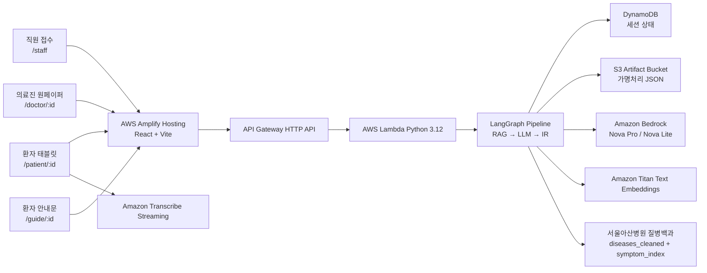

# 🏗️ 기술 아키텍처

> 루트 [README](../README.md)의 요약을 상세히 풀어 쓴 문서입니다. 화면, API, 백엔드 처리, AWS AI 서비스, 저장소 단위의 전체 흐름과 기술 선택 이유, Lambda 내부 파이프라인 구현을 다룹니다.

위 그림은 문진톡톡의 전체 시스템 아키텍처입니다. 사용자 요청이 Amplify · WAF · API Gateway를 거쳐 Lambda로 전달되고, 즉시 응답용 API Lambda와 백그라운드 분석 Lambda(LangGraph)로 나뉘며, Transcribe · DynamoDB · Bedrock(Titan·Nova) · S3와 연동됩니다. 하단은 분석 Lambda 내부의 문진 처리 5단계(입력 검증 → 방언 정규화·RAG → LLM 의미 추출 → 검증·표준 매칭 → 저장·원페이퍼 동기화)를 보여줍니다.

아래 그래프는 같은 흐름을 화면, API, 백엔드 처리, AWS AI 서비스, 저장소 단위로 다시 정리한 텍스트 버전입니다.

문진 분석 파이프라인은 LangChain과 LangGraph로 구성했습니다. LangChain은 Bedrock 호출과 프롬프트 구성, JSON 파싱을 일관된 체인으로 묶는 데 사용했습니다. LangGraph는 이 체인들을 “방언 RAG 참고 → LLM 구조화 → 스키마 검증 → 증상 검색 → 원페이퍼 생성” 순서로 연결하고, 검증 실패나 재분석 같은 분기 흐름을 관리합니다.

문진톡톡의 백엔드는 단순히 LLM을 한 번 호출해 결과를 그대로 쓰는 구조가 아니라, 각 단계의 입력·출력·검증 결과를 상태로 넘기며 처리하는 그래프형 문진 분석 파이프라인입니다.

## 기술 스택

| 영역 | 기술 | 도입 목적 |
| --- | --- | --- |
| Frontend | React 18, Vite, React Router | 접수·태블릿·원페이퍼·안내문을 하나의 경량 SPA로 구성 |
| Hosting | AWS Amplify | 배포 URL 제공, HTTPS, 프론트 빌드 자동화. WAF는 제출 AWS 환경에서 별도 연계 |
| API / Compute | API Gateway HTTP API, AWS Lambda (Python 3.12) | 문진 세션과 LLM 파이프라인을 서버리스로 실행 |
| 음성 인식 | Amazon Transcribe Streaming | 음성 원본을 저장하지 않고 확정 텍스트만 처리 |
| LLM | Amazon Bedrock — Nova Pro(강), Nova Lite(경) | 복잡한 구조화·검토와 가벼운 표준화 작업을 분리 |
| 임베딩 | Amazon Titan Text Embeddings v2 | 환자 표현과 표준 증상 문서의 의미 유사도 계산 |
| 파이프라인 | LangGraph `StateGraph` + LangChain Core Runnable/Parser | Lambda 내부 처리 순서, retry, 검증 실패 분기, trace 가능한 흐름 구성 |
| 검증 | Pydantic v2 스키마 검증 | LLM JSON의 필수 필드, enum, 원문 quote, extra field를 엄격히 확인 |
| 검색 | BM25 + Titan Vector Hybrid IR | 키워드 일치와 의미 유사도를 함께 사용해 표준 증상 후보 검색 |
| 저장 | DynamoDB(상태·포인터) + S3(가명처리 산출물) | 운영 상태와 상세 산출물을 분리해 저장 최소화 |
| 인프라 정의 | AWS SAM (`template.yaml`) | API Gateway, Lambda, 환경변수, 권한을 코드로 관리 |

## Lambda 내부 파이프라인 구현

위 그래프의 `Lambda 함수`의 내부 문진 처리는 아래 코드로 구현됩니다. LangGraph는 처리 노드의 순서와 재시도 분기를 정의하고, LangChain은 Bedrock 프롬프트 호출과 JSON 파싱을 일관된 체인으로 묶는 역할을 합니다.

| 코드 | 하는 일 |
| --- | --- |
| `src/pipeline_graph.py` | 문진 분석 노드 순서와 retry/safety/stop 조건부 분기 정의 |
| `src/pipeline_nodes.py` | RAG 참고 컨텍스트, LLM 구조화, Pydantic/원문 검증, Hybrid IR, S3 저장을 노드 함수로 분리 |
| `src/langchain_prompting.py` | `ChatPromptTemplate → Bedrock converse → JsonOutputParser` 체인 구성 |
| [docs/LANGGRAPH_PIPELINE.md](LANGGRAPH_PIPELINE.md) | 답변이 실제로 거치는 파이프라인 흐름 상세 |

---

## 관련 문서

- [🔍 Hybrid IR — 표준 증상 매칭](HYBRID_IR.md)
- [LangGraph 문진 파이프라인](LANGGRAPH_PIPELINE.md)
- [내부 데이터 스키마](DATA_SCHEMA.md)
- [프로젝트 아키텍처 구조](PROJECT_STRUCTURE.md)
