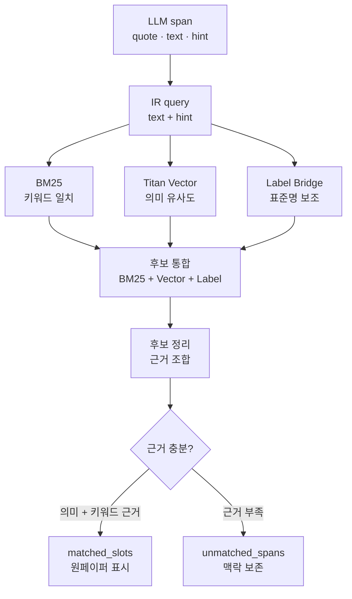

# 🔍 Hybrid IR — 표준 증상 매칭

> 루트 [README](../README.md)의 Hybrid IR 개념 요약을 상세히 풀어 쓴 문서입니다. LLM 자유 생성 결과를 표준 증상 데이터에 다시 연결하는 매칭 구조와 처리 흐름, 예시를 다룹니다.

문진톡톡의 증상 매칭은 LLM의 자유 생성 결과에 의존하지 않고, 서울아산병원 질병백과 기반 표준 증상 데이터와 다시 대조하는 Hybrid IR 구조로 설계했습니다.

어르신 환자가 말하는 표현은 사투리, 축약어, 생활 표현이 섞여 있습니다. 예를 들어 “목이 칼칼하다”, “코가 줄줄 흐른다”, “숨이 답답하다”처럼 말해도 의료진 화면에는 원천 데이터에 존재하는 표준 증상명으로 정리되어야 합니다.

이를 위해 문진톡톡은 LLM이 추출한 `source_quote`, `normalized_text`, `name`을 검색 질의로 만들고, BM25 키워드 검색과 Titan Vector 의미 검색을 함께 사용해 표준 증상 후보를 찾습니다. 여기에 표준 증상명과 직접 가까운 표현을 보존하는 label bridge를 더해, 단순 키워드 검색이 놓치는 표현과 단순 벡터 검색이 흔들리는 표현을 함께 보완합니다.

즉, Hybrid IR은 “LLM이 증상명을 만들어내는 단계”가 아니라, 환자의 자연어 표현을 검증 가능한 표준 증상 데이터에 연결하는 안전장치입니다. 이 구조 덕분에 원페이퍼에는 임의로 생성된 증상명이 아니라 원천 데이터에 존재하는 표준 증상 후보만 표시됩니다.

IR은 내부 배포 환경의 비공개 런타임 데이터(`diseases_cleaned.json`, `symptom_index.json`, `Titan embedding cache`)를 사용합니다. 이 데이터는 서울아산병원 질병백과 기반 데이터와 그 파생 데이터이므로 공개 Git 저장소에는 포함하지 않았습니다. 공개 저장소에는 데이터 구조와 배치 기준만 남기고, 데모/운영 배포에서는 팀 내부 비공개 경로의 런타임 데이터를 Lambda 패키지에 포함해 Hybrid IR이 동일하게 작동하도록 구성했습니다.

1. LLM extraction이 환자 발화에서 `source_quote`, `normalized_text`, `name`을 가진 증상 span을 생성합니다.
2. IR query는 `normalized_text + name`을 중심으로 구성하고, 원문 `source_quote`는 화면 근거와 검증용으로 보존합니다.
3. BM25가 표준 증상 문서와의 키워드 일치를 계산합니다.
4. Titan embedding이 환자 표현과 표준 증상 문서 사이의 의미 유사도를 계산합니다.
5. 표준 증상명과 직접 가까운 표현은 label bridge로 보조 반영합니다.
6. BM25 상위 후보, Titan vector 상위 후보, label 후보를 합친 뒤 근거가 겹치는 후보를 우선 정리합니다.
7. Titan vector 의미 신호, BM25 키워드 신호, label 근거가 함께 잡히는 후보를 우선 확정하고, 근거가 부족한 후보는 증상으로 확정하지 않고 문진 맥락으로 보존합니다.
8. 운영 산출물에는 임의 점수, 전체 후보 목록, prompt 전문을 저장하지 않고, 원페이퍼에는 `매칭됨`, `우선 확인`처럼 의료진이 해석 가능한 상태만 표시합니다.

## Hybrid IR 처리 흐름

즉, 환자 증상 발화를 “서울아산병원 질병백과 기반 표준 증상 목록”과 비교하여 근거가 충분한 항목만 다시 고르는 단계를 거칩니다.

| 그래프 항목 | 쉬운 설명 | 예시 |
| --- | --- | --- |
| `LLM span` | 환자 발화에서 증상처럼 보이는 조각을 뽑고, 원문과 표준화 표현을 함께 남깁니다. | 원문 `"목도 아프고"` → 표준화 `"목이 아픔"` → 힌트 `"목 통증"` |
| `IR query` | 검색에 사용할 짧은 문장을 만듭니다. | `목이 아픔 목 통증` |
| `BM25` | 같은 단어가 많이 겹치는 표준 증상 문서를 찾습니다. | `목`, `통증` 단어가 있는 증상 후보가 올라옴 |
| `Titan Vector` | 단어가 조금 달라도 뜻이 가까운 표준 증상 문서를 찾습니다. | `"목이 칼칼함"`이 `인후통`, `목의 통증`과 가까운지 비교 |
| `Label Bridge` | 표준 증상명과 거의 같은 표현은 놓치지 않도록 보조합니다. | 환자 표현에 `두통`이 있으면 `두통` 후보를 보존 |
| `후보 정리` | 키워드, 의미, 표준명 근거를 함께 보고 후보를 추립니다. | BM25와 Titan이 모두 지지하는 후보를 우선 확인 |
| `근거 충분?` | 근거가 충분하면 원페이퍼에 증상으로 표시하고, 부족하면 문진 맥락에만 남깁니다. | 확실하면 `매칭됨`, 애매하면 의료진이 원문으로 확인 |

## 예시

| 단계 | 예시 |
| --- | --- |
| 환자 원문 | `"어제부터 목도 아프고 콧물도 조금 나와요"` |
| 표준화 | `"어제부터 목도 아프고 콧물도 조금 나와요"` |
| LLM span | `source_quote="목도 아프고"`, `normalized_text="목이 아픔"`, `type="new"`, `status="있음"`, `symptom_hint="목 통증"` |
| IR query | `목이 아픔 목 통증` |
| 표준 증상 매칭 | 서울아산병원 질병백과 기반 `symptom_index`와 `diseases_cleaned`에서 생성한 후보 중 `목의 통증` slot 확정 |
| 원페이퍼 표시 | 증상명, 환자 원문 quote, 문진 맥락을 함께 표시하고 의료진이 확인 |

이 흐름에서 LLM의 역할은 “환자 말을 의미 단위로 정리하는 것”이고, 실제 표준 증상명은 원천 데이터 기반 IR과 validator를 통과해야만 남습니다.

---

## 관련 문서

- [🏗️ 기술 아키텍처](ARCHITECTURE.md)
- [LangGraph 문진 파이프라인](LANGGRAPH_PIPELINE.md)
- [내부 데이터 스키마](DATA_SCHEMA.md)
