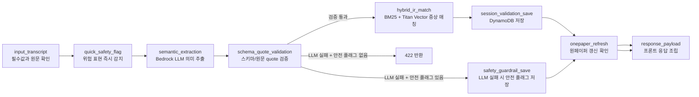

# LangGraph 문진 처리 파이프라인

이 문서는 환자 답변 1개가 백엔드에서 어떤 순서로 처리되는지 설명합니다.
실제 실행 코드는 `backend/serverless/src/pipeline_graph.py`에 있습니다.

## 핵심 원칙

- 환자 발화는 먼저 Amazon Transcribe Streaming으로 텍스트가 됩니다.
- `/process-answer`는 그 텍스트 1개를 받아 LangGraph 파이프라인을 실행합니다.
- LLM이 만든 값은 Pydantic schema와 `source_quote` 검증을 통과해야 저장됩니다.
- 증상 매칭은 LLM이 아니라 Hybrid IR이 수행합니다.
- 안전 플래그는 LLM 실패 중에도 누락되지 않도록 별도 분기로 저장합니다.
- 각 노드 실행 결과는 `orchestration.trace`와 `pipeline_trace`로 DynamoDB에 남습니다.

## 노드 흐름



## 각 노드가 하는 일

| 노드 | 역할 | 주요 결과 |
| --- | --- | --- |
| `input_transcript` | `session_id`, `question_id`, `question_type`, `transcript`를 확인합니다. | 빈 발화나 필수값 누락이면 400 |
| `quick_safety_flag` | 객혈, 흉통, 호흡곤란 등 즉시 확인해야 할 표현을 감지합니다. | `preliminary_safety_flag` |
| `semantic_extraction` | Bedrock Nova 모델로 의미 단위 분할, 표준화, 구조화를 수행합니다. | `spans`, `structured`, `llm_meta` |
| `schema_quote_validation` | LLM 출력이 고정 schema와 원문 quote 검증을 통과했는지 확인합니다. | 통과, 422, 안전 분기 중 하나 |
| `hybrid_ir_match` | 증상 문항만 `diseases_cleaned.json` + `symptom_index.json` 기반 IR을 수행합니다. | `matched_slots`, `unmatched_spans`, `ir_trace` |
| `session_validation_save` | 검증된 결과를 DynamoDB session item에 저장합니다. | `responses.Qx`, `question_results.Qx`, `onepager` |
| `safety_guardrail_save` | LLM 추출이 실패해도 위험 표현이 있으면 직원 확인 상태로 남깁니다. | safety-only 응답 저장 |
| `onepaper_refresh` | 저장 단계에서 생성된 원페이퍼 갱신을 trace에 명시합니다. | trace 기록 |
| `response_payload` | 프론트엔드가 사용할 최종 JSON을 조립합니다. | API 응답 |

## DynamoDB에서 확인할 위치

세션 item 안에서 문항별로 아래 필드를 확인하면 됩니다.

```json
{
  "responses": {
    "Q1": {
      "text": "어제부터 목이 칼칼하고 코가 막혀요",
      "spans": [],
      "matched_slots": [],
      "structured": {},
      "llm_meta": {},
      "orchestration": {
        "graph": "munjin_langgraph_answer_pipeline",
        "version": "v1",
        "active_path": [
          "input_transcript",
          "quick_safety_flag",
          "semantic_extraction",
          "schema_quote_validation",
          "hybrid_ir_match",
          "session_validation_save"
        ],
        "trace": []
      },
      "pipeline_trace": []
    }
  }
}
```

## LLM과 IR의 경계

- `semantic_extraction`: LLM이 환자 발화를 구조화합니다.
- `schema_quote_validation`: LLM 결과가 신뢰 가능한지 검증합니다.
- `hybrid_ir_match`: LLM이 만든 증상 후보를 표준 증상 인덱스와 비교합니다.
- IR 단계 안에서는 LLM이 새 증상을 생성하지 않습니다.
- `ir_trace`에는 BM25 점수, Titan vector 점수, label score, 채택/거절 이유가 남습니다.

## 실패 시 동작

- LLM schema/quote 검증 실패, 안전 플래그 없음: 잘못된 구조를 저장하지 않고 422를 반환합니다.
- LLM schema/quote 검증 실패, 안전 플래그 있음: 안전 플래그만 저장하고 직원 확인 상태로 남깁니다.
- Hybrid IR에서 증상 매칭 실패: `unmatched_spans`에 남기고 표준 증상으로 확정하지 않습니다.
